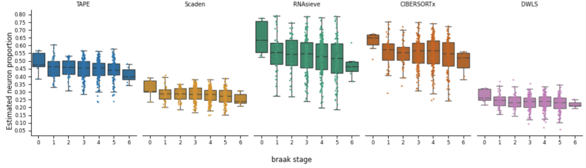
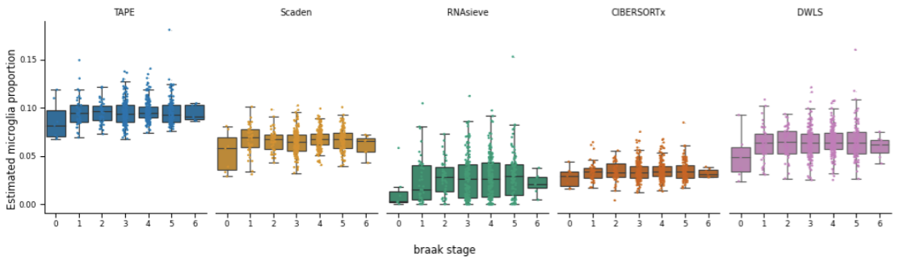
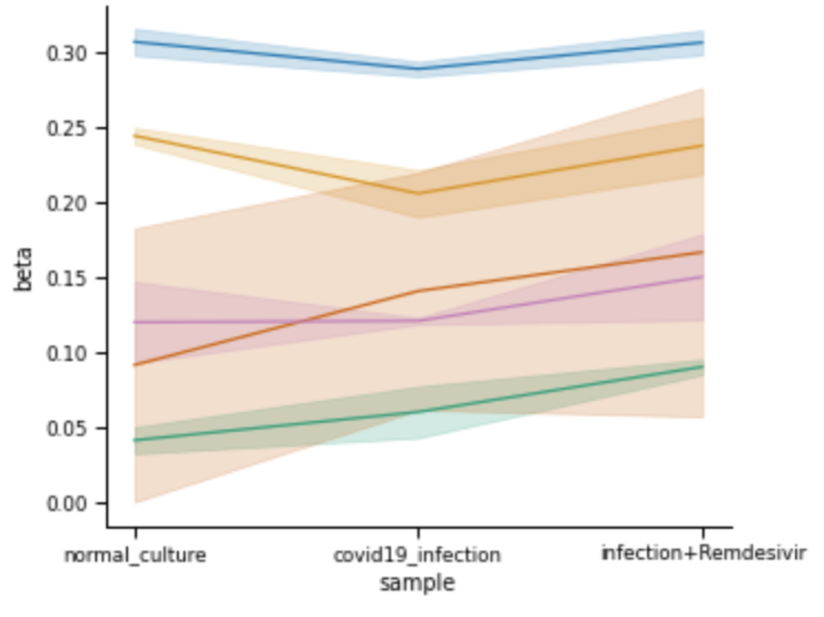
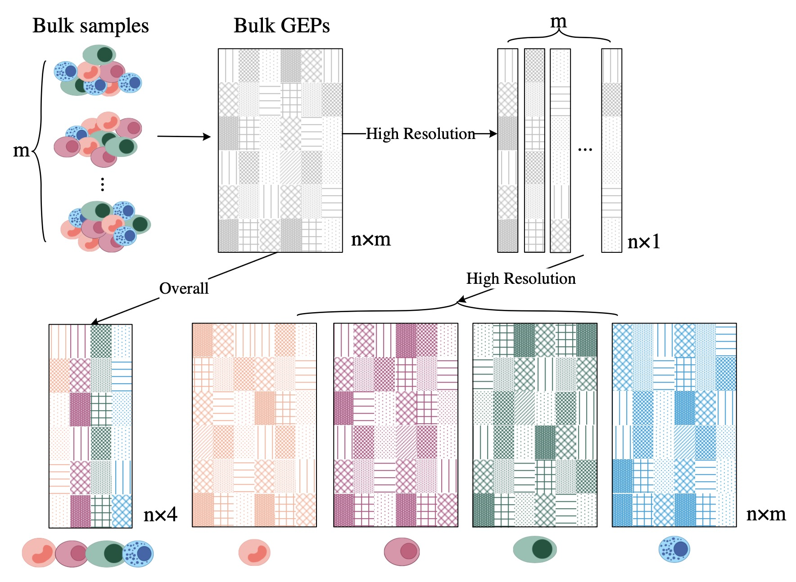
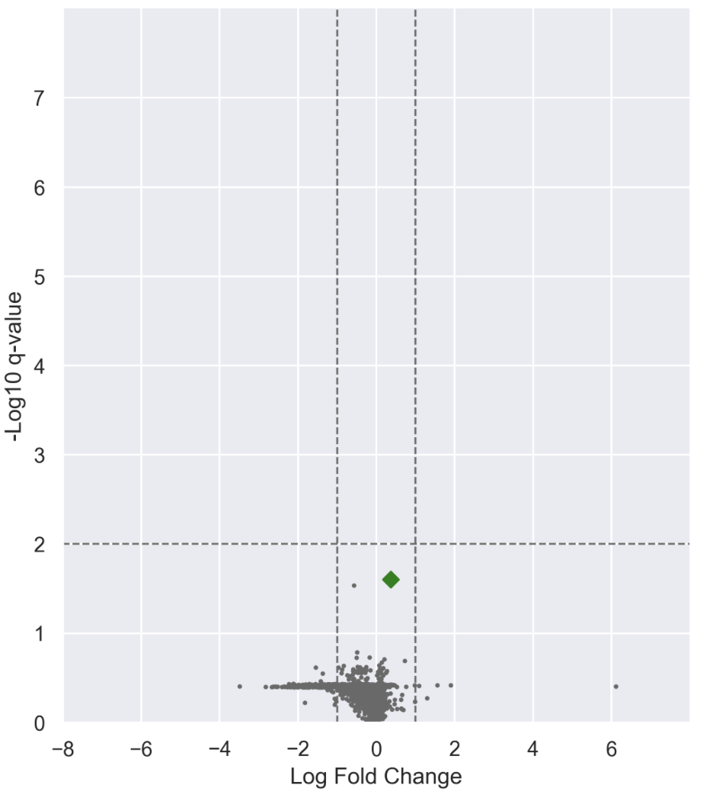
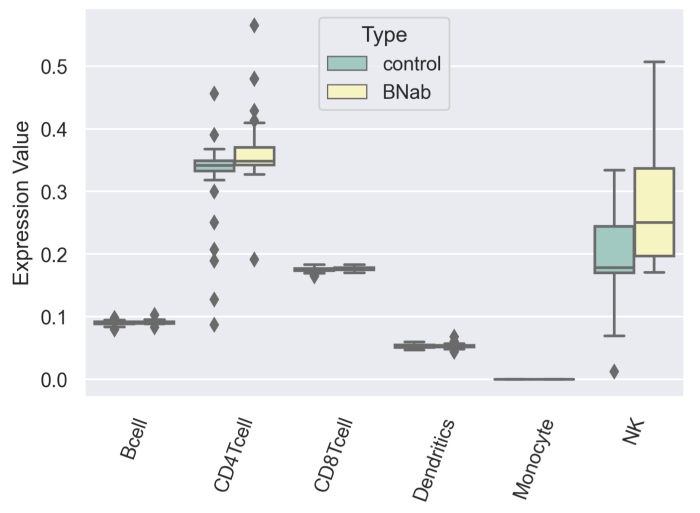
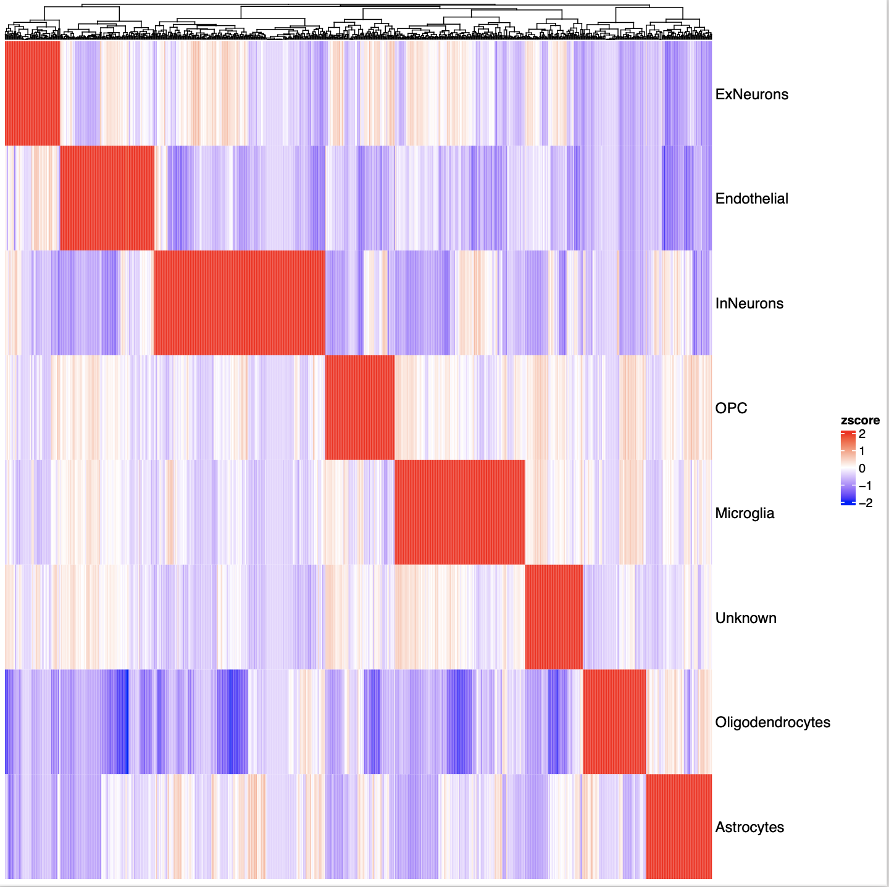
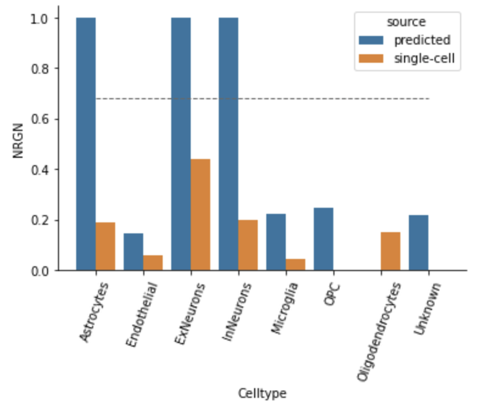

## Figures&Tables

### Table 0
performance on simulated data ❓

### Figure 0
Method Overview ❓

### Figure 1
Deconvolution overview (Yixuan and me will plot this later) ❓

performance on real data (data has not been uploaded by Yixuan) **How to show this?** ❓

detailed comparisons between TAPE and Scaden (notebook: scaden&TAPE.ipynb) ❓

Time consumption comparisons (notebook: time_comparison.ipynb) ❓

### Figure 2
comparisons on ROSMAP dataset (notebook: ROSMAPclinical_analysis.ipynb)

> 1. increase of microglia and decrease of neurons ❓
>
>    
>
>    
>
> 2. **do not compare with other method**

comparisons on COVID-19 PBMC & islet datasets (notebook: lineplot.ipynb)

> 1. need to build a good representation of islet dataset ❓
>
>    
>
> 2. bar plot of PBMC data is good, and it is applicable. ✅
>
>    **I dont have this...** Yumeng did it

### Figure 3
Diagram of adaptive stage (Yixuan has shared it in the group) ✅

concordance between prediction and single-cell data (notebook: GEPanalysis.ipynb) ✅

HIV PBMC dataset:
> 1. heatmap of different cell types' gene expression (notebook: heatmap.ipynb) ❌
>
>    > Not nice...
>
> 2. volcano plot of DEG in different cell types (notebook: HIV_analysis.ipynb)❓
>
>    > need to refine the plot...
>    >
>    > 
>
> 3. boxplot of RAB11FIP5 expression value in different celltypes (notebook: HIV_analysis.ipynb) ❓
>
>    > Any other representation?
>    >
>    > need to refine
>    >
>    > 

ROSMAP dataset: 
> 1. heatmap of GEP (gene expression profile) in the 'overall' mode  ✅
>
>    
>
> 2. barplot of differentially expressed NRGN gene❓
>
>    

### Figure 4
plots from logan. I guess it will be very nice. ✅
