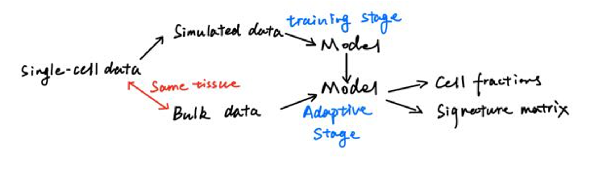

## Usage
### Requied Files
1. single-cell RNA-seq data (cell types should be labeled): tabular data, seperated by TAB. The indices are cell types, the columns are gene names. It should be stored in txt format.

2. bulk RNA-seq data: tabular data, seperated by defined symbols. The indices are sample name, the columns are gene names.

3. gene length file: *If you want to normalize simulated data into TPM/FPKM format, you should specify the location of this file.* Tabular data, seperated by TAB, columns should contain: 

  | Gene name | Transcript start (bp) | Transcript end (bp) |
  | --------- | --------------------- | ------------------- |

### Procedures
Understanding the whole procedure for deconvolution is very useful for you to master the flexible usage of TAPE. Here is the diagram:



Obviously, given bulk data with single-cell data or simulated data or a trained model could produce the expected results. So, there will be three different ways to use TAPE. Since it is hard to guarantee that the intersected genes are the same when users try to use a trained model as start point, we only introduce two of them, start from single-cell data or simulated data.

### First way: from single-cell data to results

For convenience, we used a function to do this way:

```python
# single-cell data -> results
from TAPE import Deconvolution
SignatureMatrix, CellFractionPrediction = \
    Deconvolution(sc_ref, bulkdata, sep='\t',
                  datatype='TPM', genelenfile='./GeneLength.txt',
                  mode='overall', adaptive=True,
                  save_model_name=None)
```

parameters:

1. sep: '**\t**', '**,**' or '**;**', this depends on the seperation methods in your bulk data.

2. datatype: use '**TPM**', '**FPKM**' or '**counts**', this should be the same with your bulk datatype.

3. mode: '**overall**' or '**high-resolution**'. In the 'high-resolution' mode, returned signature matrix will be a dictionary like {'cell type': gene expression data, ...} and the gene expression data is a dataframe. In the 'overall' mode, the signature matrix is a dataframe and the indices are cell types, the columns are gene names.

4. adaptive: **True** or **False**. If adaptive is False, then it would not predict signature matrix, the return will be ***None***. If adaptive is True, the returned signature matrix format depends on the mode.

### Second way: from simulated data to results

Typically, users need to generate simulated data at first. This could be achieved through the following code:

```python
# generate simulated data
from TAPE.simulation import generate_simulated_data
simulated_data = generate_simulated_data(sc_ref,
                                         outname=None, prop=None,
                                         n=500, samplenum=5000)
```

parameters:

1. outname: a ***String*** to specify the name to save the simulated data. The saved file is a **.h5ad** file. This kind files could be read through the package [AnnData](https://anndata.readthedocs.io/en/latest/).
2. prop: **ndarray** shapes like [sample_number, celltype_number]. If this is None, the function will randomly create an array to sample the data.
3. n: **int**eger number. Specifying how many cells will be sampled for each pseudo-bulk data.
4. samplenum: **int**eger number. Specifying how many pseudo-bulk data will be created after sampling.

Then, users could use the following to make predictions:

```python
# simulated data -> results
SignatureMatrix, CellFractionPrediction = \
    Deconvolution(simulated_data, bulkdata, sep='\t',
                  datatype='TPM', genelenfile='./GeneLength.txt',
                  mode='overall', adaptive=True,
                  save_model_name=None)
```

Note that, the first parameter of this function could recieve a file location string or an object (DataFrame or AnnData) depends on different start points.

